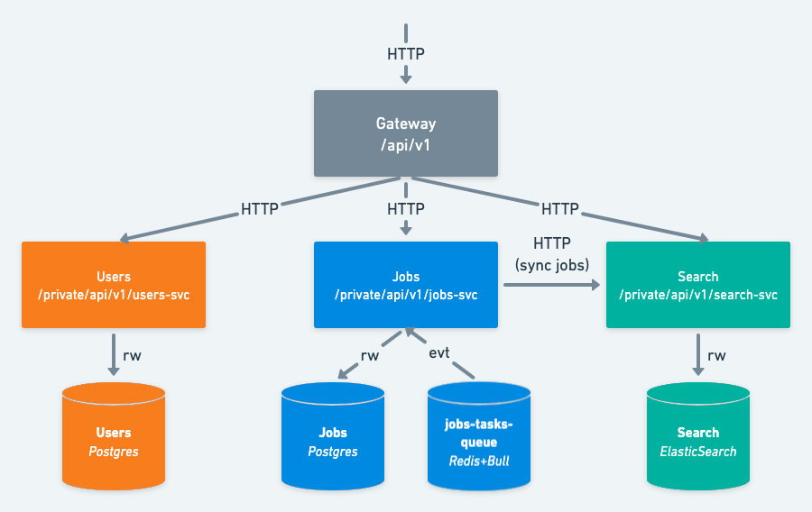
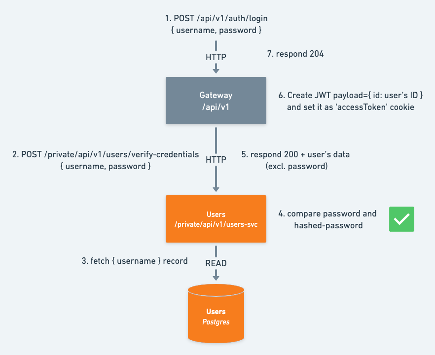
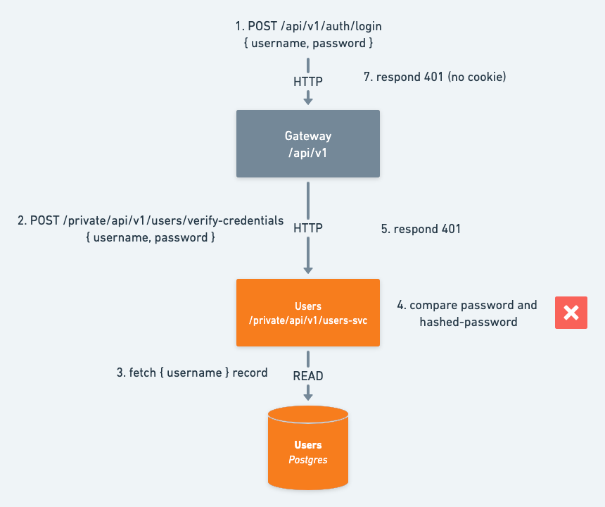
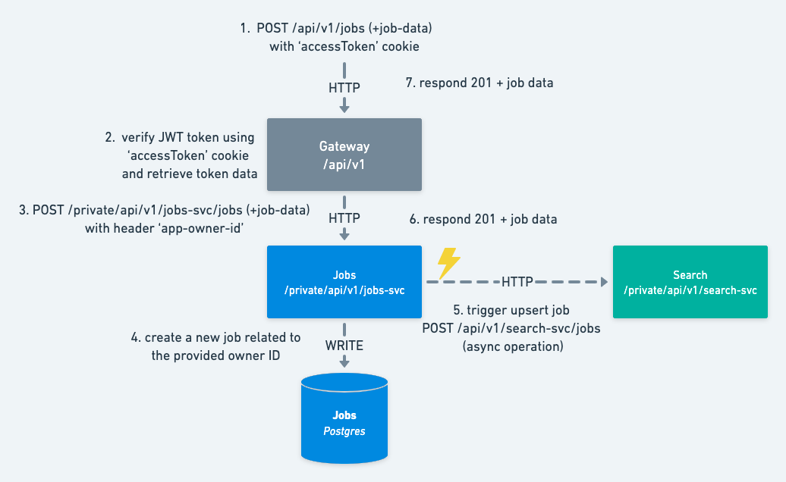

# Job Board Sample Application

[Specification](./specification.pdf)

## Solution's Overview



The system is composed of 4 microservices:

- `gateway` - The gateway service is the entry point of the system. It is responsible for handling the authentication
  and authorization of the users. It also acts as a proxy for the other services.
- `jobs` - The jobs service is responsible for managing the jobs. It is the only service that can create, update and
  delete jobs and updates search microservice after any job related operation. Using a task queue (Redis+Bull) it
  periodically (every 10 minutes) checks for jobs that are not yet uploaded to search service and uploads them.
- `search` - The search service is responsible for indexing and searching jobs. It is used by the `jobs` service to
  update the index and by the `gateway` service to search for jobs.
- `users` - The users service is responsible for managing the users. It is the only service that can create a user,
  validate credentials and fetch user data. It is used by the gateway to "authenticate" users.

## Security/Auth flows

The `gateway` service is responsible for handling the authentication and authorization of the users. It uses the `users`
service to validate the credentials and fetch user data. Using user data it creates JWT tokens and assign them as
cookies during registration or login requests. At logout it simply removes the aforementioned access token cookie.

Successful login example:


Failed login example:


As job creation, update and deletion are only allowed for authenticated users, the `gateway` service checks for the
presence of the access token cookie and validates it. If the token is valid, it allows the request to pass through while
setting 'app-owner-id' header with the token's user id. The `jobs` service uses this header relate the incoming requests
with
this specific user (e.g. creates a job with the provided id as the owner id, or only allows for job updates that belong
to this user).

Create job example:



## Setup Dev Environment

Prerequisites:

- Docker + Docker-compose
- [Node Version Manager](https://github.com/nvm-sh/nvm)

Copy example .env

```bash
cp .env.example .env
```

Install NodeJS

```bash
nvm install node # installs latest nodejs version
node -v > .nvmrc # saves current nodejs version for later use
nvm use # loads and uses saved nodejs version
npm install # installs nodejs packages
```

## Running apps + services with docker-compose

```bash
npm run dc:start:all # starts all apps and services
```

## Running the services with docker-compose

```bash
npm run dc:start:services # starts all services
```

## Visit the gateway's API:

```bash
open http://localhost:3000/api/v1
```

## Running the apps natively

```bash
# development
$ SERVICE_NAME=<service-name> npm run start

# watch mode
$ SERVICE_NAME=<service-name> npm run start:dev

# production mode
$ SERVICE_NAME=<service-name> npm run start:prod
```

HINT: SERVICE_NAMES= `jobs | gateway | search | users` (e.g. `SERVICE_NAME=jobs npm run start:dev`)

## Testing

```bash
# unit tests
$ npm run test

# test coverage
$ npm run test:cov

# Service-only e2e tests
$ SERVICE_NAME=<service-name> npm run test:e2e
```
